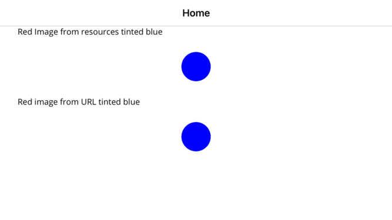
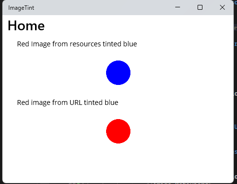

# IconTintColorBehavior issue with URL on Windows

Running this program on iOS on an iPhone SE (3rd generation) 17.2 simulator properly renders the following:

The program also renders correctly on Android in a Pixel 5 - API 33 emulator.

However, running the same application on Windows 11 Pro Version 22H2 doesn't properly change the tint of the image loaded from a URL:

